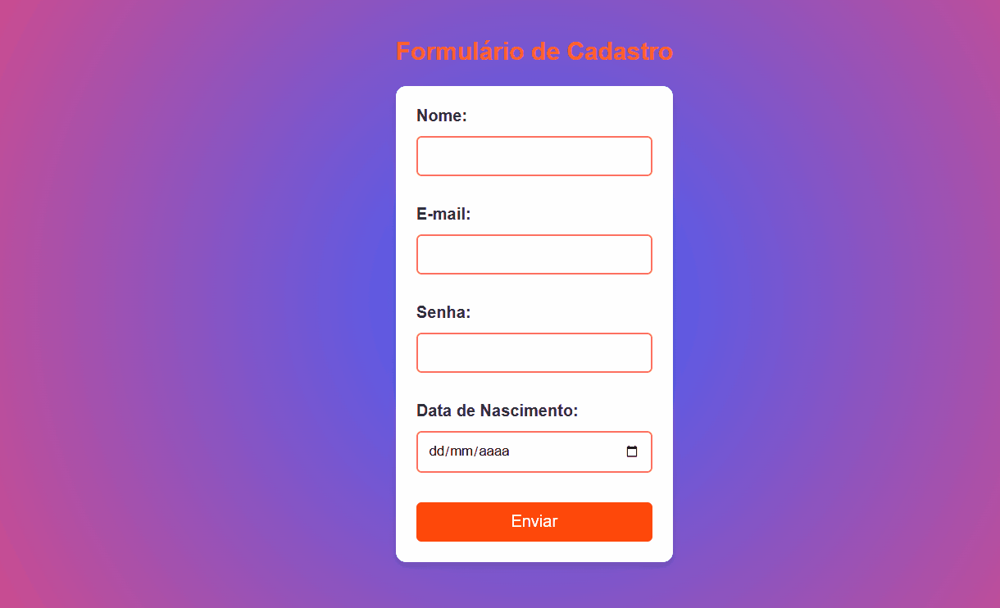

# Formulário de Cadastro 📝

Este projeto consiste em um formulário de contato simples, criado utilizando HTML5 e CSS3. O formulário permite que os usuários insiram informações básicas, como nome, e-mail, senha e data de nascimento, e envia os dados através de um botão de envio.

## Funcionalidades:

* Campos de texto para ***nome*** e ***e-mail***. ✔️
* Calendário para inserir data. ✔️
* ***Validação*** básica de campos obrigatórios. ✔️

Sinta-se à vontade para fazer o clone deste projeto e adaptá-lo conforme suas necessidades!

[]